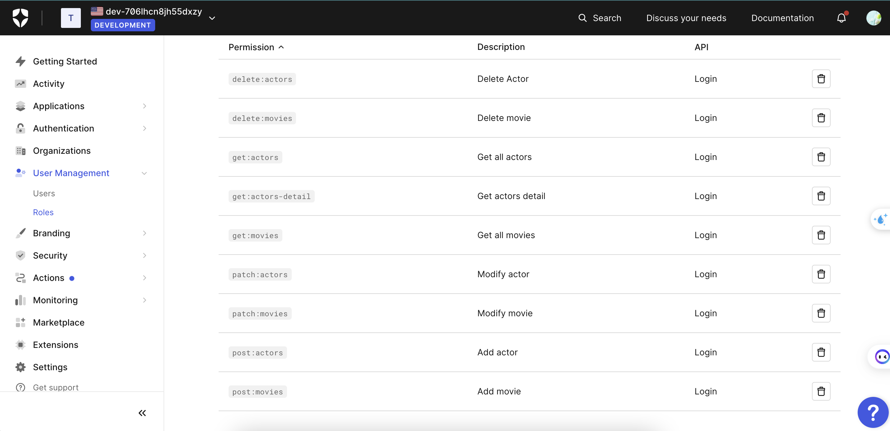

# Capstone Full Stack

## Full Stack Capsone Project

Udacity has decided to open a new digitally enabled cafe for students to order drinks, socialize, and study hard. But they need help setting up their menu experience.

The Casting Agency models a company that is responsible for creating movies and managing and assigning actors to those movies. You are an Executive Producer within the company and are creating a system to simplify and streamline your process.

`Casting Assistant`

- Can view actors and movies

`Casting Director`

- All permissions a Casting Assistant has and…
- Add or delete an actor from the database
- Modify actors or movies

`Executive Producer`

- All permissions a Casting Director has and…
- Add or delete a movie from the database

## Database Setup

### Create Postgres Database

```bash
dropdb capstone
createdb capstone
```

## Auth0 Setup

### Create Auth0 Application


### Create Auth0 API and Permissions


### Create Auth0 Roles and Users


Casting Assistant: `get:actors`, `get:actors-detail`, `get:movies`


Casting Director: `get:actors`, `get:actors-detail`, `get:movies`, `patch:actors`, `delete:actors`, `patch:movies`, `post:actors`


Executive Producer: Full Access


### URL after deploying on the Render

https://fsnd-686v.onrender.com
